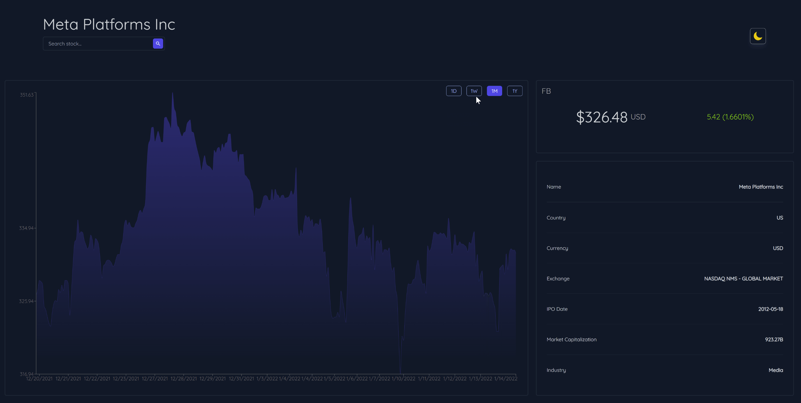

# Stock Dashboard Web Application

This project is a stock dashboard web app that allows users to search and obtain quotes for stocks, view financial metrics, and see data visualizations. The app integrates with the Finnhub API to provide real-time stock information and historical chart data.



## Features

- **Search for a Stock**: Easily search for stocks using their ticker symbols (e.g., AAPL, FB, GOOG).
- **Quote a Stock**: Retrieve current price, percent change, and other key financial metrics.
- **Get More Details**: Access detailed information about a stock including name, currency, market cap, and more.
- **Historical Chart Data**: View historical chart data for stocks over various periods (day, week, month, year).
- **Theme Selection**: Customize the app with dark or light themes using React Context.

## Tech Stack

- **React**: Front-end JavaScript library for building user interfaces.
- **JavaScript**: Programming language used for app functionality.
- **TailwindCSS**: Utility-first CSS framework for styling.

## Usage

1. **Search for a Stock**: Enter the ticker symbol of the stock in the search bar.
2. **View Stock Quote**: The app will display the current price, percent change, and other financial metrics.
3. **Get More Details**: Click on the stock to see more detailed information.
4. **View Historical Data**: Use the chart to view historical data over different periods.
5. **Change Theme**: Toggle between dark and light themes using the theme switcher.

## Installation

To get started with the project, follow these steps:

1. Clone the repository:
    ```sh
    git clone https://github.com/yourusername/stock-dashboard-app.git
    cd stock-dashboard-app
    ```

2. Install dependencies:
    ```sh
    npm install
    ```

3. Create a `.env` file in the root directory and add your Finnhub API key:
    ```
    REACT_APP_FINNHUB_API_KEY=your_finnhub_api_key
    ```

4. Start the development server:
    ```sh
    npm start
    ```

5. Open your browser and navigate to `http://localhost:3000`.

## Acknowledgements

- Thank you to DLabbate for providing instructional materials.
